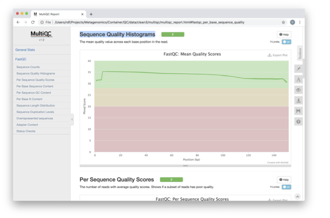

***************
Assembling data
***************

- What constitutes a good assembly?
- How to estimate assembly quality
- Host decontamination
- Raw read deposition vs assembly
- Co-assembly

Prerequisites
---------------

For this tutorial you will need to make a working directory to store
your data in. 

.. code-block:: bash

   mkdir -p ~/BiATA/session1/data
   chmod -R 777 ~/BiATA
   export DATADIR=~/BiATA/session1/data

In this directory, downloaded the tarball from http://ftp.ebi.ac.uk/pub/databases/metagenomics/mgnify_courses/biata_2020/

.. code-block:: bash

   cd  ~/BiATA/session1/data
   wget -q http://ftp.ebi.ac.uk/pub/databases/metagenomics/mgnify_courses/biata_2020/session1.tgz
   tar xzvf session1.tgz

Now makes sure that you have pulled the docker container

.. code-block:: bash

    docker pull microbiomeinformatics/biata-qc-assembly

Finally, start the docker container in the following way:

.. code-block:: bash

   docker run --rm -it  -e DISPLAY=$DISPLAY  -v $DATADIR:/opt/data -v /tmp/.X11-unix:/tmp/.X11-unix:rw  -e DISPLAY=docker.for.mac.localhost:0 biata-qc-assembly

Part 1 - Quality control and filtering of the raw sequence files
-----------------------------------------------------------------

|image1|\ Learning Objectives - in the following exercises you will learn
how to check on the quality of short read sequences: identify the
presence of adaptor sequences, remove both adaptors and low quality
sequences. You will also learn how to construct a reference database for
host decontamination. 

|image2|\  First go to your working area, the data that you downloaded
has been mounted in ``/opt/data`` in the docker container.

.. code-block:: bash

   cd /opt/data
   ls

|image1|\  Here you should see the same contents as you had from
downloading and uncompressing the session data. As we write into this
directory, we should be able to see this from inside the container, and
on the filesystem of the computer running this container. We will use
this to our advantage as we go through this practical. Unless stated
otherwise all of the following commands should be executed in the
terminal running the Docker container.

|image2|\  Generate a directory of the fastqc results

.. code-block:: bash

    cd /opt/data
    mkdir fastqc_results
    fastqc oral_human_example_1_splitaa.fastq.gz  --outdir fastqc_results
    fastqc oral_human_example_2_splitaa.fastq.gz  --outdir fastqc_results

|image2|\  Now on your **local** computer, go to the browser, and
``File -> Open File``. Use the file navigator to select the following file

    ~/BiATA/session1/data/fastqc_results/oral_human_example_1_splitaa_fastqc.html

|image4|\

Spend some time looking at the 'Per base sequence quality’. 

|image1|\  For each position a BoxWhisker type plot is drawn. The
elements of the plot are as follows:

-  The central red line is the median value

-  The yellow box represents the inter-quartile range (25-75%)

-  The upper and lower whiskers represent the 10% and 90% points

-  The blue line represents the mean quality

The y-axis on the graph shows the quality scores. The higher the score
the better the base call. The background of the graph divides the y axis
into very good quality calls (green), calls of reasonable quality
(orange), and calls of poor quality (red). The quality of calls on most
platforms will degrade as the run progresses, so it is common to see
base calls falling into the orange area towards the end of a read.

|image3|\  What does this tell you about your sequence data? When do the
errors start? 

In the pre-processed files we see two warnings, as shown on the left
side of the report. Navigate to the “Per bases sequence content"

|image5|\ 

|image3|\ At around 15-19 nucleotides, there DNA composition becomes
very even, however, a the 5’ end of the sequence there  are distinct
differences. Why do you think that is?

|image2|\ Open up the FastQC report corresponding to the reversed
reads. 

|image3|\  Are there any significant differences between to the forward
and reverse files?

For more information on the FastQC report, please consult the
‘Documentation’ available from this
site: https://www.bioinformatics.babraham.ac.uk/projects/fastqc/

|image2|\ We are currently only looking at two files but often we want
to look at many files. The tool multiqc aggregates the FastQC results
across many samples and creates a single report for easy comparison.
Here we will demonstrate the use of this tool

.. code-block:: bash

    cd /opt/data
    mkdir multiqc_results
    multiqc fastqc_results -o multiqc_results

In this case, we provide the folder containing the fastqc results to
multiqc and the -o allows us to set the output directory for this
summarised report.

|image2|\  Now on your **local** computer, open the summary report from
MultiQC. To do so, go to your browser, and use ``File -> Open File``. Use the
file navigator to select the following file

  ~/BiATA/session1/data//multiqc_results/multiqc_report.html

|image6|\

|image2|\  Scroll down through the report. The sequence quality
histograms show the following results from each file as two separate
lines. The 'Status Checks’ show a matrix of which samples passed check
and which ones have problems. 

|image3|\ What fraction of reads are duplicates? 

|image1|\  So, far we have looked at the raw files and assessed their
content, but we have not done anything about removing duplicates,
sequences with low quality scores or removal of the adaptors. So, lets
start this process. The first step in the process is to make a database
relevant for decontaminating the sample. It is always good to routinely
screen for human DNA (which may come from the host and/or staff
performing the experiment). However, if the sample is say from mouse,
you would want to download the the mouse genome. 

|image2|\  In the following exercise, we are going to use two “genomes”
already downloaded for you in the decontamination folder. To make this
tutorial quicker and smaller in terms of file sizes, we are going to use
PhiX (a common spike in) and just chromosome 10 from human.  

.. code-block:: bash

    cd /opt/data/decontamination

For the next step we need one file, so we want to merge the two
different fasta files. This is simply done using the command line tool
cat.

.. code-block:: bash

    cat phix.fasta GRCh38_chr10.fasta > GRCh38_phix.fasta

Now we need to build a bowtie index for them:

.. code-block:: bash

    bowtie2-build GRCh38_phix.fasta  GRCh38_phix.index  

|image1|\  It is possible to automatically download a pre-indexed human
genome in Bowtie2 format using the following command (but do not do this
now, as this will take a while to download):

    +----------------------------------------------------------------------+
    | kneaddata_database --download human_genome bowtie2                   |
    +----------------------------------------------------------------------+

|image2|\  Now we are going to use the `GRCh38_phix` database and clean-up
our raw sequences. kneaddata is a helpful wrapper script for a number
of pre-processing tools, including Bowtie2 to screen out contaminant
sequences, and Trimmomatic to exclude low-quality sequences. We also
have written wrapper scripts to run these tools (see below), but using
kneaddata allows for more flexibility in options.

.. code-block:: bash

    cd /opt/data/
    mkdir clean

We now need to uncompress the fastq files. 

.. code-block:: bash

    gunzip -c oral_human_example_2_splitaa.fastq.gz > oral_human_example_2_splitaa.fastq
    gunzip -c oral_human_example_1_splitaa.fastq.gz > oral_human_example_1_splitaa.fastq
    
    kneaddata --remove-intermediate-output -t 2 --input oral_human_example_1_splitaa.fastq --input oral_human_example_2_splitaa.fastq --output /opt/data/clean --reference-db /opt/data/decontamination/GRCh38_phix.index --trimmomatic-options  "SLIDINGWINDOW:4:20 MINLEN:50" --bowtie2-options "--very-sensitive --dovetail" --remove-intermediate-output

|image1|\ The options above are:

    +---------------------------------------------------------------------------------------------+
    |                                                                                             |
    | \* **--input**, Input FASTQ file. This option is given twice as we have paired-end data.    |
    |                                                                                             |
    | \* **--output**, Output directory.                                                          |
    |                                                                                             |
    | \* **--reference-db**, Path to bowtie2 database for decontamination.                        |
    |                                                                                             |
    | \* **-t**, # Number of threads to use (2 in this case).                                     |
    |                                                                                             |
    | \* **--trimmomatic-options**, Options for Trimmomatic to use, in quotations                 |
    | ("SLIDINGWINDOW:4:20 MINLEN:50" in this case). See the Trimmomatic                          |
    | website for more options.                                                                   |
    |                                                                                             |
    | \* **--bowtie2-options**, Options for bowtie2 to use, in quotations. The                    |
    | options "--very-sensitive" and "--dovetail" set the alignment parameters                    |
    | to be very sensitive and sets cases where mates extend past each other                      |
    | to be concordant (i.e. they will be called as contaminants and be                           |
    | excluded).                                                                                  |
    |                                                                                             |
    | \* **--remove-intermediate-output**, Intermediate files, including large                    |
    | FASTQs, will be removed.                                                                    |
    |                                                                                             |
    +---------------------------------------------------------------------------------------------+

**Kneaddata generates multiple outputs in the “clean” directory,
containing different 4 different files for each read.**

|image2|\ Using what you have learned previously, generate a fastqc
report for each of the `oral_human_example_1_splitaa_kneaddata_paired`
files.  Do this within the clean directory.

.. code-block:: bash

    cd /opt/data/clean
    mkdir fastqc_final
    <you construct the command>

|image2|\  Also generate a multiqc report and look at the sequence
quality historgrams. 

.. code-block:: bash

    cd /opt/data/clean
    mkdir multiqc
    <you construct the command>

|image2|\  View the multiQC report as before using your browser. You
should see something like this:

|image7|\

|image3|\  Open the previous MultiQC report and see if they have
improved? 

|image3|\  Did sequences at the 5’ end become uniform? Why might that
be? Is there anything that suggests that adaptor sequences were found? 

|image29\  To generate a summary file of how the sequence were
categorised by Kneaddata, run the following command.  

.. code-block:: bash

    cd /opt/data
    kneaddata_read_count_table --input /opt/data/clean --output kneaddata_read_counts.txt
    less kneaddata_read_counts.txt

|image3|\  What fraction of reads have been deemed to be contaminating?

|image1|\ The reads have now be decontaminated any can be uploaded to
ENA, one of the INSDC members. It is beyond the scope of this course to
include a tutorial on how to submit to ENA, but there is additional
information available on how to do this in this Online Training guide
provided by EMBL-EBI

https://www.ebi.ac.uk/training/online/course/ebi-metagenomics-portal-submitting-metagenomics-da/considerations-submitting-metagenomic-data

Part 2 - Assembly and Co-assembly
----------------------------------

|image1|\ Learning Objectives - in the following exercises you will
learn how to perform a metagenomic assembly and to start some basic
analysis of the output. Subsequently, we will demonstrate the
application of co-assembly. Note, due to the complexity of metagenomics
assembly, we will only be investigating very simple example datasets as
these often take days of CPU time and 100s of GB of memory. Thus, do not
think that there is an issue with the assemblies.

Once you have quality filtered your sequencing reads (see Part 1 of this
session), you may want to perform *de novo* assembly in addition to, or
as an alternative to a read-based analyses. The first step is to
assemble your sequences into contigs. There are many tools available for
this, such as MetaVelvet, metaSPAdes, IDBA-UD, MegaHIT. We generally use
metaSPAdes, as in most cases it yields the best contig size statistics
(i.e. more continguous assembly) and has been shown to be able to
capture high degrees of community diversity (Vollmers, et al. PLOS One
2017). However, you should consider the pros and cons of different
assemblers, which not only includes the accuracy of the assembly, but
also their computational overhead. Compare these factors to what you
have available. For example, very diverse samples with a lot of
sequence data uses a lot of memory with SPAdes. In the following
practicals we will demonstrate the use of metaSPAdes on a small sample
and the use of MegaHIT for performing co-assembly.

|image2|\ Using the sequences that you have previously QC-ed, run
metaspades. To make things faster, we are going to turn-off metaspades
own read error correction method, by specifying the command
--only-assembler. 

.. code-block:: bash

    cd /opt/data
    mkdir assembly
    metaspades.py \
            -t 2  \
            --only-assembler \
            -m 10 \
            -1 /opt/data/clean/oral_human_example_1_splitaa_kneaddata_paired_1.fastq \
            -2 /opt/data/clean/oral_human_example_1_splitaa_kneaddata_paired_2.fastq \
            -o /opt/data/assembly

|image1|\ This takes about 1 hour to complete. 

|image2|\ Once this completes, we can investigate the assembly. The
first step is to simply look at the contigs.fasta file.  

Now take the first 40 lines of the sequence and perform a blast search
at NCBI (https://blast.ncbi.nlm.nih.gov/Blast.cgi, choose
Nucleotide:Nucleotide from the set of options). Leave all other options
as default on the search page. To select the first 40 lines of sequence
perform the following:

.. code-block:: bash

    head -41 contigs.fasta

|image8|\

|image3|\ Which species do you think this sequence may be coming from?
Does this make sense as a human oral bacteria? Are you surprised by this
result at all?  

|image2|\  Now let us consider some statistics about the entire assembly

.. code-block:: bash

    cd /opt/data/assembly
    assembly_stats scaffolds.fasta

|image1|\ This will output two simple tables in JSON format, but it is
fairly simple to read. There is a section that corresponds to the
scaffolds in the assembly and a section that corresponds to the contigs.

|image3|\ What is the length of longest and shortest contigs? 

|image3|\ What is the N50 of the assembly? Given that are input
sequences were ~150bp long paired-end sequences, what does this tell you
about the assembly?

|image1|\ N50 is a measure to describe the quality of assembled genomes
that are fragmented in contigs of different length.  We can apply this
with some caution to metagenomes, where we can use it to crudely assess
the contig length that covers 50% of the total assembly.  Essentially
the longer the better, but this only makes sense when thinking about
alike metagenomes. Note, N10 is the minimum contig length to cover 10
percent of the metagenome. N90 is the minimum contig length to cover 90
percent of the metagenome.

|image2|\ Bandage (a Bioinformatics Application for Navigating De novo
Assembly Graphs Easily), is a program that creates interactive
visualisations of assembly graphs. They can be useful for finding
sections of the graph, such as rRNA, or to try to find parts of a
genome. Note, you can install Bandage on your local system. With
Bandage, you can zoom and pan around the graph and search for sequences,
plus much more. The following guide allows you to look at the assembly
graph.  Normally, I would recommend looking at the ‘
assembly_graph.fastg, but our assembly is quite fragmented, so we will
load up the assembly_graph_after_simplification.gfa.   

|image2|\  At the terminal, type 

    Bandage

In the the Bandage GUI perform the following

    Select File->Load graph

    Navigate to  /opt/data/assembly and select on assembly_graph_after_simplification.gfa

Once loaded, you need to draw the graph. To do so, under the “Graph
drawing” panel on the left side perform the following:

    Set Scope to 'Entire graph'
     
    The click on Draw graph

|image2|\ Use the sliders in the main panel to move around and look at
each distinct part of the assembly graph.

|image3|\ Can you find any large, complex parts of the graph? If so,
what do they look like. 

|image2|\  In this particular sample, we believe that strains related to
the species *Rothia dentocariosa,* a Gram-positive, round- to rod-shaped
bacteria that is part of the normal community of microbes residing in
the mouth and respiratory tract, should be present in our sample. While
this is a tiny dataset, lets try to see if there is evidence for this
genome. To do so, we will search the *R. dentocariosa* genome against
the assembly graph.

To do so, go to the “BLAST” panel on the left side of the GUI.

    Step 1 - Select Create/view BLAST search, this will open a new window    
    
    Step 2 - select build Blast database
    
    Step 3 - Load from FASTA file -> navigate to the genome folder /opt/data/genome and select GCA_000164695.fasta
    
    Step 4 - modify the  blast filters to 95% identity
    
    Step 6 - run blast
    
    Step 7 - close this window

To visualise just these hits, go back to "Graph drawing” panel. 

    Set Scope to ‘Around BLAST hits’
    
    Set Distance 2
    
    The click on Draw graph

You should then see something like this:

|image9|\

|image1|\ In the following steps of this exercise, we will look at
performing co-assembly of multiple datasets. Due to computational
limitations, we can only look a example datasets.  However, the
principles are the same. We have also pre-calculated some assemblies for
you. In the co-assembly directory, there are already 2 assemblies.  We
have a single paired-end assembly. 

.. code-block:: bash

    megahit -1 clean_other/oral_human_example_1_splitac_kneaddata_paired_1.fastq -2 clean_other/oral_human_example_1_splitac_kneaddata_paired_1.fastq -o  coassembly/assembly1 -t 2 --k-list 23,51,77 

|image2|\  Now run the assembly_stats on the contigs for this assembly.

.. code-block:: bash

   cd /opt/data
   assembly_stats coassembly/assembly1/final.contigs.fa

|image3|\  How do these differ to the ones you generated previously? What may account for these differences?

|image1|\ We have also generated the first coassembly using MegaHIT.
This was produced using the following command.  To specify the files, we
put all of the forward file as a comma separated list, and all of the
reversed as a comma separated list, which should be ordered that same in
both, such that the mate pairs match up.

.. code-block:: bash

    cd /opt/data
    megahit -1    clean_other/oral_human_example_1_splitac_kneaddata_paired_1.fastq,clean_other/oral_human_example_1_splitab_kneaddata_paired_1.fastq  -2 clean_other/oral_human_example_1_splitac_kneaddata_paired_1.fastq,clean_other/oral_human_example_1_splitab_kneaddata_paired_2.fastq -o coassembly/assembly2 -t 2 --k-list 23,51,77 

|image2|\  Now perform another co-assembly, depending on the computer
you have, either change one of the previous fastq files for the 

.. code-block:: bash

    megahit -1 clean_other/oral_human_example_1_splitab_kneaddata_paired_1.fastq,clean_other/oral_human_example_1_splitac_kneaddata_paired_1.fastq,clean/oral_human_example_1_splitaa_kneaddata_paired_1.fastq -2 clean_other/oral_human_example_1_splitab_kneaddata_paired_2.fastq,clean_other/oral_human_example_1_splitac_kneaddata_paired_2.fastq,clean/oral_human_example_1_splitaa_kneaddata_paired_2.fastq -o coassembly/assembly3 -t 2 --k-list 23,51,77   

|image1|\ This takes about 20-30 minutes. Also, if you are using a
laptop, make sure that it does not go into standby mode.

|image2|\ You should now have three different assemblies, two provide
and one generated by yourselves. Now let us compare the assemblies.

.. code-block:: bash

    cd /opt/data
    assembly_stats coassembly/assembly1/final.contigs.fa
    assembly_stats coassembly/assembly2/final.contigs.fa
    assembly_stats coassembly/assembly3/final.contigs.fa

|image1|\ We only have contigs.fa from MegaHIT, so the contigs and
scaffold sections are the same.

|image3|\  Has the assembly improved? If so how?

.. |image1| image:: media/info.png
   :width: 0.26667in
   :height: 0.26667in
.. |image2| image:: media/action.png
   :width: 0.26667in
   :height: 0.26667in
.. |image3| image:: media/question.png
   :width: 0.26667in
   :height: 0.26667in
.. |image4| image:: media/fastqc1.png
   :width: 6.26389in
   :height: 4.30833in
.. |image5| image:: media/fastqc2.png
   :width: 6.26389in
   :height: 4.30833in
.. |image6| image:: media/multiqc1.png
   :width: 6.26389in
   :height: 4.30833in

.. |image8| image:: media/blast.png
   :width: 6.26389in
   :height: 3.86181in
.. |image9| image:: media/bandage.png
   :width: 6.26389in
   :height: 3.67569in

