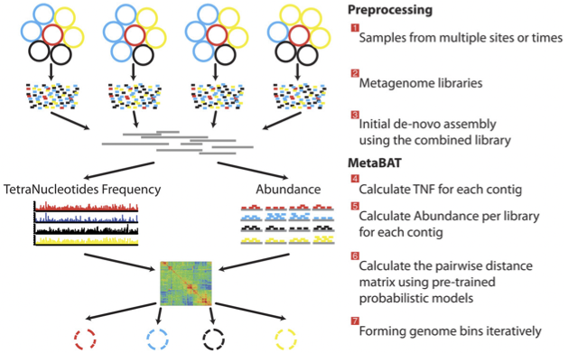
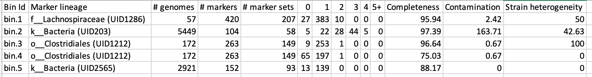

***************
MAG generation
***************

- Generation of metagenome assembled genomes (MAGs) from assemblies
- Assessment of quality (MIGMAGs)
- Taxonomic assignment

Prerequisites
---------------

For this tutorial you will need to make a working directory to store
your data in. 

.. code-block:: bash

    mkdir -p ~/BiATA/session4/data
    chmod -R 777 ~/BiATA
    export DATADIR=~/BiATA/session4/data 

In this directory, downloaded the tarball from http://ftp.ebi.ac.uk/pub/databases/metagenomics/mgnify_courses/biata_2020/

.. code-block:: bash

    cd  ~/BiATA/session4/data
    wget -q http://ftp.ebi.ac.uk/pub/databases/metagenomics/mgnify_courses/biata_2020/session4.tgz
    tar xzvf session4.tgz

Now makes sure that you have pulled the docker container

.. code-block:: bash

    docker pull microbiomeinformatics/biata-binning

Finally, start the docker container in the following way:

.. code-block:: bash

    docker run --rm -it  -e DISPLAY=$DISPLAY  -v $DATADIR:/opt/data -v /tmp/.X11-unix:/tmp/.X11-unix:rw  -e DISPLAY=docker.for.mac.localhost:0 microbiomeinformatics/biata-binning

Generating metagenome assembled genomes
----------------------------------------

|image1|\ Learning Objectives - in the following exercises you will
learn how to bin an assembly, assess the quality of this assembly with
checkM and then visualise a placement of these genomes within a
reference tree. 

|image1|\  As with the assembly process, there are many software tools available for
binning metagenome assemblies. Examples include, but are not limited to:

MaxBin: https://sourceforge.net/projects/maxbin/ 

CONCOCT: https://github.com/BinPro/CONCOCT 

COCACOLA: https://github.com/younglululu/COCACOLA 

MetaBAT: https://bitbucket.org/berkeleylab/metabat

There is no clear winner between these tools, so the best is to
experiment and compare a few different ones to determine which works
best for your dataset. For this exercise we will be using **MetaBAT**
(specifically, MetaBAT2). The way in which MetaBAT bins contigs together
is summarised in Figure 1.

|image2|\

Figure 1. MetaBAT workflow (Kang, et al. *PeerJ* 2015).

|image1|\  Prior to running MetaBAT, we need to generate coverage
statistics by mapping reads to the contigs. To do this, we can use bwa
(http://bio-bwa.sourceforge.net/) and then the samtools software
(`http://www.htslib.org <http://www.htslib.org/>`__) to reformat the
output. Again, this can take some time, so we have run it in advance. To
repeat the process, you would run the following commands:

.. code-block:: bash

    # index the contigs file that was produced by metaSPAdes:
    bwa index contigs.fasta

    # map the original reads to the contigs:
    bwa mem contigs.fasta ERR011322_1.fastq ERR011322_2.fastq > input.fastq.sam

    # reformat the file with samtools:
    samtools view -Sbu input.fastq.sam > junk 
    samtools sort junk input.fastq.sam

We should now have the files we need for the rest of the process – the
assemblies themselves (*contigs.fasta*) and a file from which we can
generate the coverage stats (*input.fastq.sam.bam).*

**Running MetaBAT**

|image3|\  Create a working directory on your desktop:

.. code-block:: bash

    tar zxvf seesion4.tgz

This should contain the following two file *contigs.fasta*
and *input.fastq.sam.bam*.

|image3|\ Create a subdirectory where files will be output:

.. code-block:: bash

    cd /opt/data/assemblies/
    mkdir contigs.fasta.metabat-bins2000

|image3|\  Run the following command to produce a
*contigs.fasta.depth.txt* file, summarising the output depth for use with
MetaBAT:

.. code-block:: bash

    cd /opt/data/assemblies/
    jgi_summarize_bam_contig_depths --outputDepth contigs.fasta.depth.txt input.fastq.sam.bam

    # now run MetaBAT

    cd /opt/data/assemblies/
    metabat2 --inFile  contigs.fasta --outFile contigs.fasta.metabat-bins2000/bin --abdFile contigs.fasta.depth.txt --minContig 2000

|image3|\ Once the binning process is complete, each bin will be
grouped into a multi-fasta file with a name structure of
**bin.[0-9].fa**.

|image3|\ Move to the output directory and look at the output of the binning process.

.. code-block:: bash

    cd /opt/data/assemblies/*contigs.fasta.metabat-bins2000/bin

|image4|\  How many bins did the process produce?

|image4|\  How many sequences are in each bin?

Obviously, not all bins will have the same level of accuracy since some
might represent a very small fraction of a potential species present in
your dataset. To further assess the quality of the bins we will use
**CheckM** (https://github.com/Ecogenomics/CheckM/wiki).

**Running CheckM**

|image1|\  **CheckM** has its own reference database of single-copy
marker genes. Essentially, based on the proportion of these markers
detected in the bin, the number of copies of each and how different they
are, it will determine the level of **completeness**, **contamination**
and **strain heterogeneity** of the predicted genome. 

|image3|\  Before we start, we need to configure checkM.

.. code-block:: bash

    mkdir checkm_data
    mv checkm_data_2015_01_16.tar.gz checkm_data
    tar zxvf checkm_data_2015_01_16.tar.gz
    checkm data setRoot /opt/data/checkm_data

This program has some handy tools not only for quality control, but also
for taxonomic classification, assessing coverage, building a
phylogenetic tree, etc. The most relevant ones for this exercise are
wrapped into the **lineage_wf** workflow.

Move back to the top level directory 

.. code-block:: bash

    cd /opt/data/assemblies/

Now run CheckM with the following command:

.. code-block:: bash

    checkm lineage_wf -x fa contigs.fasta.metabat-bins2000 checkm_output --tab_table -f MAGs_checkm.tab --reduced_tree -t 4

Due to memory constraints (< 40 GB), we have added the option
**--reduced_tree** to build the phylogeny with a reduced number of
reference genomes.

Once the **lineage_wf** analysis is done, the reference tree can be
found in **checkm_output/storage/tree/concatenated.tre**. Additionally,
you will have the taxonomic assignment and quality assessment of each
bin in the file **MAGs_checkm.tab** with the corresponding level of
**completeness**, **contamination** and **strain heterogeneity** (Fig.
2). A quick way to infer the overall quality of the bin is to calculate
the level of **(completeness - 5*contamination)**. You should be aiming for an overall score of at
least **70-80%**.

 |image5|\

Figure 2. Example output of CheckM

Before we can visualize and plot the tree we will need to convert the
reference ID names used by CheckM to taxon names. We have already
prepared a mapping file for renaming the tree (**rename_list.tab**). We
can then do this easily with the **newick utilities**
(http://cegg.unige.ch/newick_utils).

To do this, run the following command:

.. code-block:: bash

    nw_rename checkm_output/storage/tree/concatenated.tre rename_list.tab > renamed.tree

**Visualising the phylogenetic tree**

We will now plot and visualize the tree we have produced. A quick and
user- friendly way to do this is to use the web-based **interactive Tree
of Life** (**iTOL**): http://itol.embl.de/index.shtml

**iTOL** only takes in newick formatted trees, so we need to quickly
reformat the tree with **FigTree**
(http://tree.bio.ed.ac.uk/software/figtree/).

You should be able to run FigTree as follows:

.. code-block:: bash

    figtree

|image3|\  Open the **renamed.tree** file with **FigTree** and then
select from the toolbar **File -> Export Trees**. In the **Tree file
format** select **Newick** and export the file as **renamed.nwk** (choose a name you will recognise if you plan to use the shared account described below).

|image3|\  To use **iTOL** you will need a user account. For the
purpose of this tutorial we have already created one for you with an
example tree. The login is as follows:

**User:**\  *EBI_training*

**Password:**\  *EBI_training*

After you login, just click on **My Trees** in the toolbar at the top
and select

**IBD_checkm_tree.nwk** from the **Imported trees** workspace.

Alternatively, if you want to create your own account and plot the tree
yourself

follow these steps:

   **1)** After you have created and logged in to your account go to **My Trees**

   **2)** From there select **Upload tree files** and upload the tree
   you exported from **FigTree**

   **3)** Once uploaded, click the tree name to visualize the plot

   **4)** To colour the clades and the outside circle according to the
   phylum of each strain, drag and drop the files **iTOL_clades.txt** and
   **iTOL_ocircles.txt** into the browser window

Once that is done, all the reference genomes used by **CheckM** will be
coloured according to their phylum name, while all the other ones left
blank correspond to the **target genomes** we placed in the tree.
Highlighting each tip of the phylogeny will let you see the whole
taxon/sample name. Feel free to play around with the plot.

|image4|\  Does the CheckM taxonomic classification make sense? What about the unknowns? What is their most likely taxon?

.. |image1| image:: media/info.png
   :width: 0.26667in
   :height: 0.26667in

.. |image3| image:: media/action.png
   :width: 0.25in
   :height: 0.25in
.. |image4| image:: media/question.png
   :width: 0.26667in
   :height: 0.26667in

